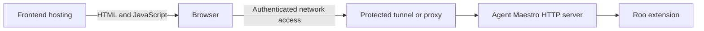

# Roomote Control Demo

A mobile-friendly interface for Roo Code tasks through Agent Maestro. It supports connection selection, task history, SSE updates, and task actions. This is an integration example, not an independently authenticated backend.

## Local Development

Install and start Agent Maestro with a Roo-compatible extension. From this directory:

```bash
pnpm install
pnpm dev
```

Open `http://localhost:3000/roo` and connect to the AM HTTP origin, normally `http://127.0.0.1:23333`. The main UI is [src/app/roo/page.tsx](src/app/roo/page.tsx); API and streaming helpers are under [hooks](src/app/roo/hooks/).

## Remote Access

**Configure authenticated access before publishing a tunnel or opening a firewall port.** AM's LLM API key covers only Anthropic/OpenAI/Gemini routes. It does not protect Roo task actions, filesystem operations, or workspace management under `/api/v1`. Keep the MCP port private unless separately protected.

Use an access-controlled tunnel, VPN, or reverse proxy and verify that an unauthenticated request to the AM origin is rejected. Apply the policy to the API origin, not just the frontend deployment. The demo sends no API authentication header and does not opt into cross-origin cookie credentials; an access solution must account for browser authentication, preflight requests, and streaming POSTs. A frontend login alone is insufficient.

To host the UI on Vercel, import this directory as the project root and use the checked-in [vercel.json](vercel.json). Enter the protected AM origin in the connection screen after verifying access from the intended browser/device.

### Network Path and CORS

The deployment serves the UI; API traffic goes from the browser directly to the configured origin:



Changing CORS headers on Vercel's frontend does not configure AM's API. AM currently uses permissive CORS. CORS controls browser response access and is not authentication; use network or gateway access controls regardless of origin policy.

## SSE Integration

Follow the [AM Roo HTTP/SSE contract](../../docs/roo-routes-events.md). Events use camelCase names such as `taskCreated` and `taskCompleted`, with JSON object payloads.

`taskCompleted` can precede final message content and is not a terminal event. Keep reading until AM closes after a complete follow-up/completion-result message or an abort. Do not finalize using a fixed delay, and distinguish an unexpected disconnect from successful completion. The old `task_completed` and `stream_closed` names are not emitted.

Review endpoint URLs and logs before sharing them. Do not put access credentials into source control.
